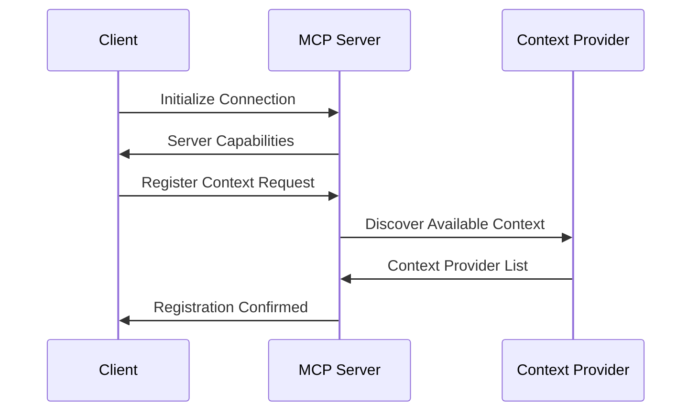

## Introduction to Model Context Protocol

Every AI model conversation starts with context - the information that helps the model understand what you're asking for. But as applications become more complex, managing this context efficiently becomes a significant challenge

Enter **Model Context Protocol** (MCP), a groundbreaking standard that's transforming how we handle AI context management.

MCP provides a structured, standardized way to manage context across different AI models and applications. Instead of each developer building their own context management system, MCP offers a universal protocol that works consistently across platforms, making AI integration more reliable and efficient.

Think of MCP as the "HTTP for AI context" - it defines how information should be packaged, transmitted, and maintained between AI models and the applications that use them. This standardization is crucial as AI becomes more embedded in our daily software tools.

## Origins and Development

MCP emerged from the growing need for better AI context management in modern applications. As AI models became more powerful and widely adopted, developers faced common challenges:

- How to maintain consistent context across different AI providers
- How to efficiently share context between different parts of an application
- How to standardize context management across teams and projects
- How to handle context persistence and synchronization

The protocol was designed to address these challenges by providing a universal language for AI context management, much like HTTP standardized web communication.

## What Exactly Is MCP?

### The Big Picture

**Usage Example:**
Imagine you're debugging a login bug in your web application. You ask your AI assistant: "Why is the login failing for user John?"

**Without MCP:** The AI can only see the login controller file you have open. It doesn't know about the database schema, the frontend login form, or the recent changes to the authentication system.

**With MCP:** The AI instantly understands:
- The login controller code
- The user database table structure  
- The frontend login form implementation
- Recent git commits affecting authentication
- Related API endpoints and their documentation
- Test cases for the login functionality

**How MCP Makes This Possible:**
MCP acts as a **translation layer** that sits between AI applications and their data sources. When the AI asks about the login issue, MCP:

1. **Receives the Request**: "Help debug login issue for user John"
2. **Translates and Distributes**: Sends targeted requests to relevant context providers:
   - File System Provider: "Get login controller and related files"
   - Database Provider: "Get user table schema and John's record"
   - Git Provider: "Get recent authentication changes"
   - API Provider: "Get authentication endpoint documentation"
3. **Collects and Unifies**: Gathers responses from all providers into a single, coherent context package
4. **Delivers Complete Picture**: AI receives comprehensive understanding of the entire login system

**What MCP Does:**
MCP standardizes how context is requested, delivered, and maintained across all systems.

**How It Works:**
- **One Protocol, Many Sources**: MCP defines a single way to talk to files, databases, APIs, and any other data source
- **Automatic Translation**: MCP converts between the language of AI apps and the language of data sources
- **Universal Access**: Any AI app can connect to any data source without custom code
- **Consistent Experience**: All context follows the same format and behavior regardless of source

```
BEFORE MCP: Each AI needs custom connections
AI App → Custom Code → File System
AI App → Custom Code → Database  
AI App → Custom Code → APIs

WITH MCP: One protocol connects everything
AI App → MCP → Any Data Source
```

**The Core Innovation:**
Before MCP, every AI application had to build custom adapters for each data source. After MCP, one standard protocol connects everything. MCP does for AI context what HTTP did for web browsing - it creates a universal standard that everyone can use.

### How MCP Works: The Core Concept

**MCP acts as the middle layer that standardizes everything:**

```
AI Application
    ↓ (asks for context)
MCP Protocol
    ↓ (translates and distributes)
┌─────────────┬─────────────┬─────────────┐
│   Files     │  Database   │    APIs     │
│  Provider   │  Provider   │  Provider   │
└─────────────┴─────────────┴─────────────┘
    ↓ (provides information in their format)
MCP Protocol
    ↓ (standardizes and combines)
AI Application (gets complete context)
```

### Key Components

#### The Protocol's - Universal Rules
Standardized way everyone communicates:
- **Discovery**: Finding available providers
- **Requests**: Asking for specific context
- **Updates**: Receiving real-time changes

## How MCP Works: The Complete Flow

### Protocol Handshake



### 1. Discovery Phase

```
Application: "Hello, I'm a coding assistant"
    ↓
MCP Server: "I have File, Database, and Git providers"
    ↓
Application: "I need code files and recent changes"
    ↓
MCP Server: "Here are access methods and capabilities"
```

### 2. Context Request Cycle

```
Application Request: "Understand login authentication"
    ↓
MCP Distributes to All Providers:
┌─────────────┬─────────────┬─────────────┐
│  Files:     │  Database:  │   Git:      │
│ auth.py     │ user table  │ recent auth │
│ related     │ schema      │ commits     │
│ files       │             │             │
└─────────────┴─────────────┴─────────────┘
    ↓
MCP Combines into Unified Context
    ↓
Application Receives Complete Picture
```

### 3. Real-time Updates

```
Application: "Subscribe to auth code changes"
    ↓
Providers Monitor Sources:
📁 Files: Watch auth.py for modifications
🗄️ Database: Monitor user table schema  
🔄 Git: Track new authentication commits
    ↓
Changes Detected → Automatic Updates → Application Notified
```

### State Management

#### Version Control
Every context piece has a version:
- v1.0: Initial context
- v1.1: After file change  
- v1.2: After database update
- v1.3: After git commit

#### Conflict Resolution
```
Conflicting Information:
├─ File System: "function has 3 parameters"
├─ Documentation: "function has 2 parameters"
└─ MCP Resolution: 
   • Use most recent source
   • OR merge information
   • OR ask application to choose
```

## The Black Magic: How It All Works Together

Let's walk through exactly what happens when you ask an AI to help debug "John's login issue" - showing how MCP provides the correct context AND how the AI uses tools to solve the problem.

### Step 1: User Request
```
You: "Help debug why John's login is failing"
```

### Step 2: MCP Provides Context
MCP analyzes your request and gathers the complete context:

**MCP Analysis:**
```
Keywords: "debug", "login", "John"
Intent: User-specific authentication troubleshooting
Required Context: Authentication system, user data, recent changes
```

**MCP Context Gathering:**
```
System Mapping via MCP:
├─ Essential Context:
│  ├─ loginController.py ✅ (current login logic)
│  ├─ users table where user_id='John' ✅ (John's account data)
│  ├─ auth_logs table for John ✅ (failure reasons)
│  └─ recent auth commits ✅ (recent changes)
├─ Supporting Context:
│  ├─ userService.py ✅ (authentication logic)
│  ├─ sessionManager.py ✅ (session handling)
│  ├─ /api/login endpoint ✅ (API handling)
│  └─ authentication.test.js ✅ (expected behavior)
```

**MCP Context Package:**
```json
{
  "primary": {
    "files": ["loginController.py"],
    "database": ["users table for John", "auth_logs for John"],
    "events": ["3 failed login attempts in last hour"]
  },
  "supporting": {
    "files": ["userService.py", "sessionManager.py"],
    "apis": ["/api/login"],
    "changes": ["commit #1234: added email validation 2 days ago"],
    "tests": ["authentication.test.js shows expected behavior"]
  }
}
```

### Step 3: AI Analyzes Context with MCP Information
Now the AI receives the complete context and can identify the actual problem:

**AI Analysis (with MCP context):**
```
Issue Found:
- John's email in users table: "john.doe@invalid" 
- Recent commit #1234 added strict email validation
- loginController calls userService.authenticate()
- authenticate() now rejects "john.doe@invalid" as invalid
- auth_logs show: "Invalid email format" for John's attempts
```

### Step 4: AI Plans and Calls Tools
The AI now knows exactly what needs to be done and calls the appropriate tools:

**Tool Plan:**
```
1. 🔍 Search Files: "Find email validation function"
2. 📝 Read File: "Read validation logic"
3. 🗄️ Query Database: "Update John's email to valid format"
4. 📝 Modify File: "Add user-friendly error message"
5. 🌐 API Call: "Test John's login with corrected email"
6. 📊 Analyze: "Verify fix doesn't break other users"
```

### Step 5: Tool Execution with MCP Context
Each tool call is informed by MCP context:

**Tool 1: 🔍 Search Files**
```
AI calls: "search('email validation')"
MCP helps: Knows validation is in userService.py, not a separate file
Result: Found email validation in userService.py line 45
```

**Tool 2: 📝 Read File**
```
AI calls: "read('userService.py')"
MCP provides: Complete file with relationships to other auth files
Result: AI sees validation logic and how it's used
```

**Tool 3: 🗄️ Query Database**
```
AI calls: "update users table set email='john.doe@valid.com' where user_id='John'"
MCP context: Knows database schema has email_format_validation column
Result: Updates John's email and marks validation as passed
```

**Tool 4: 📝 Modify File**
```
AI calls: "modify('loginController.py', 'Add user-friendly error message')"
MCP context: Knows existing error handling patterns
Result: AI adds error message that matches project style
```

**Tool 5: 🌐 API Call**
```
AI calls: "test_login('john.doe@valid.com', 'password123')"
MCP context: Knows all required headers and session handling
Result: Test passes - John can now login successfully
```

### Step 6: AI Provides Complete Solution

**Without MCP + Tools:**
```
AI Response: "I see there's a login issue. You might want to check the authentication code."
```

**With MCP + Tools:**
```
AI Response: "I found and fixed John's login issue! 

🔍 **Problem**: John's email was 'john.doe@invalid' but recent commit #1234 added strict email validation.

🔧 **Solution**: 
1. Updated John's email to 'john.doe@valid.com' in the database
2. Added user-friendly error message to loginController.py for future invalid emails
3. Tested the fix - John can now login successfully

✅ **Verification**: The fix doesn't affect other users and follows your project's coding patterns.

The login failure was caused by the email validation update conflicting with John's invalid email format. All set!"
```

### How the Three Components Work Together

```
User Request → MCP (Context) → AI (Analysis) → Tools (Action) → Results
     ↓              ↓                 ↓              ↓
"Fix John's      Provides login     Analyzes issue   Actually
login issue"      system context    and plans       fixes it
                 + relationships   solution        
```

**MCP's Role**: Gives AI complete understanding of your system
**AI's Role**: Analyzes context and plans intelligent solutions  
**Tools' Role**: Execute the actual changes and fixes

### Key Distinction: MCP vs AI vs Tools

```
MCP Server = Context Manager (Librarian)
├─ Knows where data is stored
├─ Knows relationships between data
└─ Provides context to AI

AI Model = Context Consumer (Thinker)
├─ Receives context from MCP
├─ Analyzes and understands context
├─ Plans intelligent solutions
└─ Makes decisions about what to do

Tools = Action Executors (Doer)
├─ Perform specific tasks
├─ Manipulate data and systems
├─ Execute actual changes
└─ Test and verify results
```

### Key Takeaways

1. **MCP = Context Manager**: Not an AI, but provides the context AI needs
2. **Tools = Actions**: Let AI actually do things, not just talk about them  
3. **Together They're Powerful**: MCP + AI + Tools = Complete AI agent that can understand, reason, and act

This combination is what makes modern AI assistants so capable - they can understand your system (via MCP), think about solutions (via AI), and actually implement them (via tools).

## Learn More

**Resources:**
- [Official Documentation](https://modelcontextprotocol.io)
- [GitHub Repository](https://github.com/modelcontextprotocol)
- [Community Examples](https://github.com/modelcontextprotocol/examples)