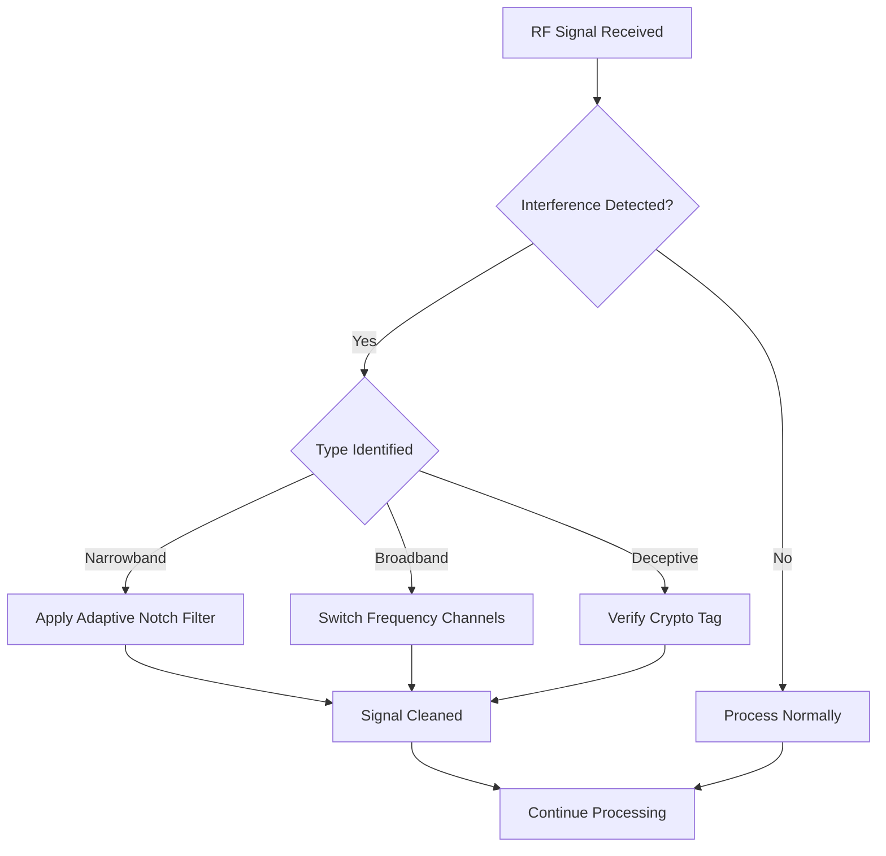

# Introduction

Every wireless connection faces an invisible battlefield. Radio frequency (RF) interference—whether deliberate jamming by adversaries or accidental noise from nearby devices—can disrupt critical communications. 

Your smartphone drops calls in crowded stadiums. GPS navigation fails in military operations. Smart car safety systems malfunction in traffic. These aren't just inconveniences; they represent fundamental vulnerabilities in our wireless world.

Companies across consumer, automotive, and defense sectors invest billions in counter-measures. They must balance robust protection against tight constraints: size, weight, power, and cost (SWaP-C). This post explores how modern systems outsmart interference through clever engineering and emerging technologies.

# Understanding RF Interference

## The Jammer's Toolkit

Interference comes in several flavors, each exploiting different weaknesses in wireless systems:

| Interference Type | How It Works | Primary Targets |
|-------------------|--------------|-----------------|
| **Noise Jamming** | Overwhelms signals with broadband noise | Tactical radios, GPS receivers |
| **Spot Jamming** | Focuses power on one frequency | Fixed-frequency communication links |
| **Sweep Jamming** | Rapidly scans across frequencies | Frequency-hopping systems |
| **Deceptive Jamming** | Replays legitimate signals with false data | Authentication systems, radar |

## Why Simple Defenses Fail

Most basic receivers use **threshold detection**—they declare a signal present when its strength exceeds a set level. This approach works in clean environments but crumbles under attack:

- A noise jammer raises the noise floor, hiding legitimate signals
- A deceptive jammer mimics real signals above the threshold
- Replay attacks capture and rebroadcast valid traffic

The core problem: many systems lack robust ways to verify signal authenticity beyond basic power measurements.

# Real-World Impact

## Military Systems

Modern fighter jets face sophisticated electronic warfare. Without protection, jamming can:
- Blind radar systems during critical phases
- Disrupt communications with command and control
- Compromise navigation and targeting systems

## Consumer Applications

Even everyday systems suffer:
- **Smart vehicles**: Adaptive cruise control radar can be fooled by nearby cars' radar signals
- **Industrial IoT**: Wireless sensor networks may drop critical data during interference
- **Smartphones**: GPS fails in urban canyons with multipath interference

The consequences range from reduced performance to complete system failure.

# The Counter-Measure Arsenal

## Frequency Agility

### Frequency-Hopping Spread Spectrum (FHSS)
The classic defense: jump between dozens or hundreds of frequencies per second. Modern FHSS systems hop across 100+ channels in milliseconds, following pseudo-random patterns known only to authorized receivers.

**How it works**: Both transmitter and receiver share a secret key determining the hop sequence. Without this key, jammers must blanket the entire frequency range—requiring massive power.

### Direct-Sequence Spread Spectrum (DSSS)
Instead of hopping frequencies, DSSS spreads signals across wide bandwidths using mathematical codes. The signal appears as low-level noise unless you know the specific spreading code.

## Smart Filtering

### Adaptive Notch Filtering
These digital filters identify interference signatures and create "notches" to remove specific frequencies while preserving desired signals. Think of them as intelligent noise-cancellation headphones for radio waves.

### AI-Powered Anomaly Detection
Machine learning models trained on normal signal patterns can detect subtle deviations indicating interference. Neural networks run on embedded GPUs or FPGAs, maintaining SWaP efficiency while providing adaptive protection.

## Hardware-Level Protection

### Physical-Layer Authentication
Embed cryptographic tags directly into RF waveforms. Receivers verify these tags before processing data, rejecting spoofed signals even if they perfectly mimic legitimate ones.

### Hardware Isolation & Redundancy
- Separate RF front-ends from digital processing paths
- Multiple antennas with different polarizations
- Cross-validation between sensor types (radar, optical, infrared)

## Software-Defined Resilience

Software-Defined Radios (SDRs) allow rapid reconfiguration of RF parameters. Systems can adapt their defense strategies in real-time based on detected threats.

# Case Study: Automotive Radar Wars

Imagine driving in bumper-to-bumper traffic. Your car's adaptive cruise control relies on millimeter-wave radar to maintain safe distances. But five nearby cars use similar radar systems—creating a symphony of interference.

**The problem**: Multiple radar signals overlap, causing false detections or missed vehicles.

**The solution**: Modern automotive radar combines:
- FHSS-like channel switching across 77-81 GHz band
- Adaptive filtering to suppress interference from other vehicles
- AI algorithms that distinguish between genuine targets and interference

Result: Reliable performance even in dense traffic environments.

# Future Frontiers

| Emerging Technology | Promise | Challenges |
|---------------------|---------|------------|
| **Quantum-Resistant Crypto** | Protect against future quantum computers | Integration with legacy hardware |
| **Cognitive Radio Networks** | Intelligent spectrum sharing | Coordination between competing systems |
| **Neuromorphic Computing** | Ultra-low-power interference detection | Algorithm development and training |
| **Integrated RF-Cyber Security** | Unified protection across protocol layers | Complex policy management |

# Implementation Principles

Effective interference protection follows these design principles:

1. **Layered Defense**: No single technique suffices. Combine frequency agility, authentication, and adaptive filtering.

2. **SWaP-Aware Design**: Counter-measures must respect size, weight, and power constraints. Optimize algorithms for embedded processors.

3. **Real-Time Adaptation**: Static defenses become obsolete. Systems must learn and evolve as new threats emerge.

4. **Cross-Domain Validation**: Verify data from multiple sensors before taking action. Radar, optical, and infrared data should confirm each other.

# Conclusion

RF interference represents an ongoing arms race between attackers and defenders. Success requires combining proven techniques (frequency hopping, adaptive filtering) with cutting-edge approaches (AI detection, quantum-resistant cryptography).

The most resilient systems treat interference protection not as an add-on but as a fundamental design requirement. They anticipate threats, adapt in real-time, and maintain functionality even under sophisticated attacks.

As our world becomes increasingly wireless, these protections shift from military luxuries to everyday necessities. The technologies protecting fighter jets today may soon guard your morning commute.

<!-- Spectrum illustration placeholder: Signal spectrum showing desired signal with interference patterns -->
<!--  -->

# Further Reading

- [Radar Jamming and Deception – Wikipedia](https://en.wikipedia.org/wiki/Radar_jamming_and_deception)
- [Gusain et al., "Automated and Blind Detection of Low Probability of Intercept RF Anomaly Signals," ACM MobiCom 2024](https://dspace.mit.edu/handle/1721.1/158078)
- [Delgado-Aguilera et al., "AI-Driven Real-Time Interference Detection in Manned-Unmanned Aircraft Communications," Aerospace Science and Technology, Jan 2026](https://www.sciencedirect.com/science/article/pii/S127096382500793X)
- [Judah & Kuzdeba, "Demonstrating confidence in RF machine learning systems," SPIE Defense + Commercial Sensing, Jun 2024](https://www.spiedigitallibrary.org/conference-proceedings-of-spie/13054/130540J/Demonstrating-confidence-in-RF-machine-learning-systems/10.1117/12.3014104.short)

---

