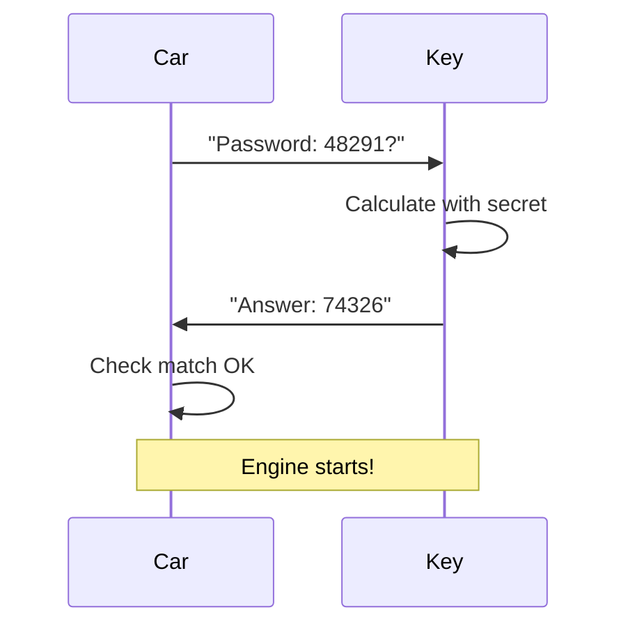
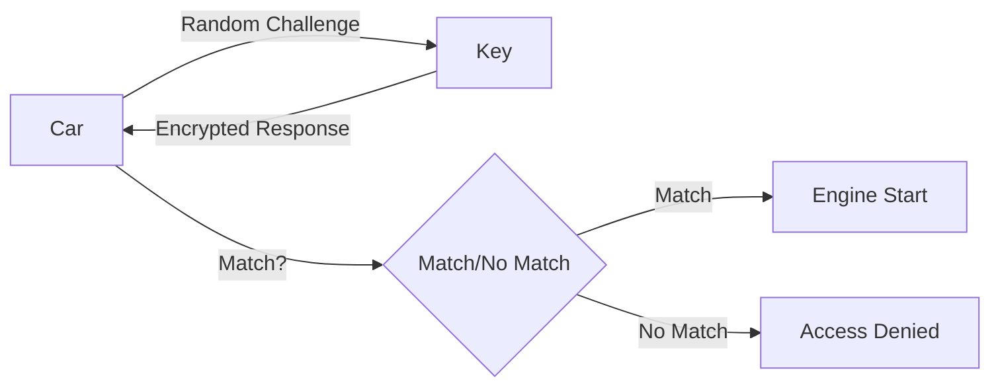
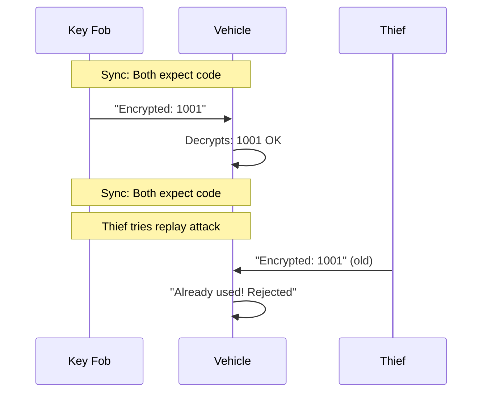
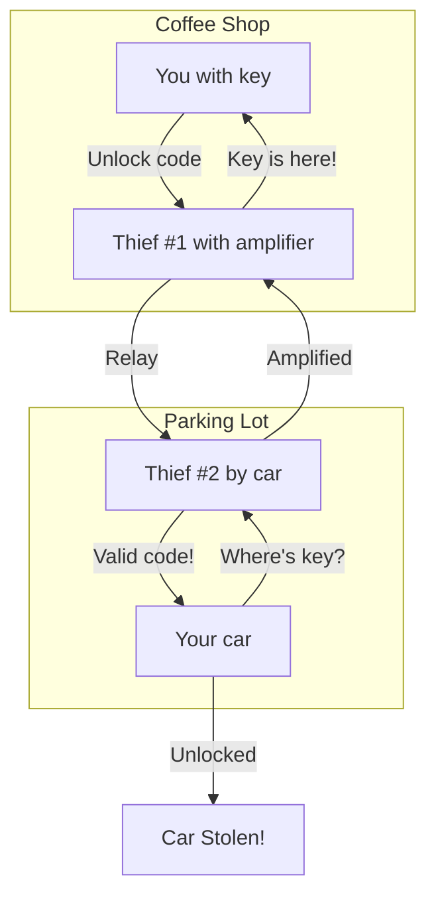
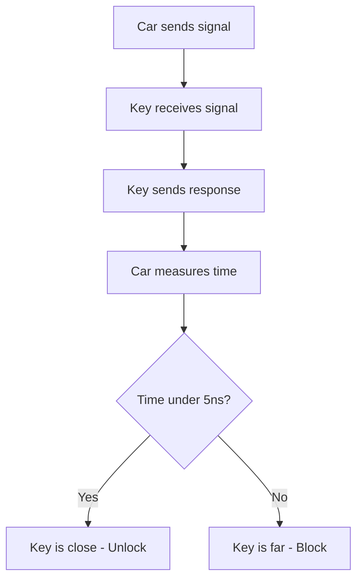

## Your Car Key is a Secret Agent

Your car key isn't just metal - it's a tiny computer having secret conversations with your car. Every time you press that button, they're swapping secret codes that change instantly.

Why? Because car thieves stopped using crowbars and started using laptops. A car is stolen every 40 seconds in the US - that's over 2,200 thefts daily.

Your key is your car's bodyguard, using the same crypto principles that protect online banking. Let's break down how it works in simple terms.

## From Simple Metal to Secret Codes

### The Old Days: Just a Piece of Metal

1970s car keys were simple metal cuts. Any locksmith could copy them for $5. Thieves just needed a slim jim and pliers to steal your car.

The problem was simple: physical locks can be picked or broken. Simple keys meant easy targets.

### First Step: Electronic Chips

In the 1990s, keys got tiny chips. Now your key and car have secret conversations.

Here's how it works: the car gives your key a random challenge, your key does some math with its secret code, then sends the answer back. The car checks if it matches. If it does, the engine starts. If not, you're not going anywhere.

The security comes from the fact that next time will be a different password. Any recorded conversation becomes useless.

### Better: Rolling Codes

But what if thieves record your unlock signal? Rolling codes solve this problem.

Think of it like a password book where page 1 has "Secret123", page 2 has "Secret456", and page 3 has "Secret789". Each time you use the key, you flip to the next page. A recorded password from page 1 becomes worthless when you're on page 2.

## How Your Key Protects Your Car

### Challenge-Response: The Secret Handshake

Your key and car do a secret handshake every time you start the engine.

This beats thieves because the random challenge is different every time, recorded conversations are useless, and the wrong key means no start.

### Rolling Codes: One-Time Passwords

Each unlock button press generates a unique code that's never repeated.

The security benefits are clear: replay attacks fail, future codes stay secret, and each car has unique keys.

### Keyless Entry: Convenience Plus Risk

Modern keys unlock when you're nearby - but this creates new vulnerabilities.

Here's how it should work: your car asks "Where's my key?" and your key responds "Right here! 2 feet away." The car says "Perfect, unlock!" But thieves can trick this system.

## Thieves vs Your Key: The Battle

### The Coffee Shop Attack (Relay Attack)

This is the most common keyless theft today:

What just happened is that your car and key talked through the thieves. Your car thinks the key is nearby, your key thinks the car is nearby, but reality is both are miles apart.

The scary facts are that this attack takes less than 30 seconds, equipment costs under $100, it works from 100+ feet away, and you never know until it's too late.

### Other Tricks Thieves Use

Signal jamming is when thieves block your lock signal, so you think your car is locked when it's not. They wait for you to leave, then steal your unlocked car.

Code cloning involves advanced attacks that copy key codes, requires special equipment, and mostly targets older systems.

Physical attacks mean breaking into the CAN bus (your car's nervous system), overriding security systems, and requires getting inside first.

## The Future: Smarter Protection

### Ultra-Wideband (UWB): The Distance Guardian

This is new technology that stops relay attacks cold. Instead of measuring signal strength (which is easy to fake), UWB measures time with laser precision.

Here's how it works: it measures signal time in nanoseconds, calculates exact distance in centimeters, detects when relay attacks add delay, and only unlocks if key is actually nearby.

Tesla already uses this technology, and more brands are coming soon.

### Other Future Tech

Phone as Key systems let your phone become your car key, using your phone's security like fingerprint and face ID, and can be disabled if lost.

Multi-Factor Security combines key plus fingerprint plus PIN, creating multiple layers of protection that are harder to bypass all at once.

## How to Protect Your Car Right Now

### Stop Relay Attacks (The #1 Threat)

The $20 solution is a Faraday bag - a special pouch that blocks all signals. You drop your key in when you're home, it's been tested to work on 95% of cars, and costs $15-25 online.

Quick tips that work: don't hang keys near the door, put keys in a metal box or drawer at home, check your car manual since some let you disable keyless entry, listen for the lock confirmation beep, and some cars have a PIN drive feature you should enable.

To test your protection, put your key in the bag or box, walk to your car, try to unlock it, and if there's no response, your protection is working.

### Know Your System

Basic keys have physical cuts and maybe a chip. Rolling code systems change codes each use and are safer. Keyless entry systems are most vulnerable to relay attacks. UWB is the newest tech and is relay-proof.

### If Keys Are Lost

Immediately call your dealer or locksmith. Some systems can deactivate lost keys remotely, and you should monitor your car for suspicious activity.

For prevention, keep spare keys secure, consider key trackers like AirTags, and check if your insurance covers key replacement.

---

## The Bottom Line

Your car key evolved from simple metal to a crypto supercomputer. In the 1970s, a physical key meant a $5 copy and easy theft. Now, secret codes plus rolling protection give you military-grade security.

The arms race continues: as thieves get smarter, car security gets smarter. UWB is just the beginning.

Your takeaway is that your key isn't just convenience - it's your car's bodyguard. Give it some protection like a $20 Faraday bag and it'll keep protecting your investment.

---

Want to learn more? You can test if your car is vulnerable, find Faraday bag recommendations, or read about UWB security from Tesla's documentation.

---

## Learn More

**Technical Resources:**
- [KeeLoq Algorithm Technical Details](https://en.wikipedia.org/wiki/KeeLoq)
- [Automotive Security Research Papers](https://www.usenix.org/conference/vehiclesec25)
- [Ultra-Wideband Security Specifications](https://www.csem.ch/en/annual-report/2022/3db-access-ultra-wideband-technology-improves-vehicle-security)

**Security Best Practices:**
- [National Insurance Crime Bureau Vehicle Theft Prevention](https://www.nicb.org/)
- [Automotive Security Guidelines](https://www.unece.org/documents/2020/03/wp-29-2020-08e.pdf)
- [Faraday Bag Testing and Recommendations](https://www.sans.org/reading-room/whitepapers/physical/evaluating-faraday-bags-protecting-rfid-enabled-credentials-37699)

**Industry Standards:**
- [Automotive Security Guidelines from SAE International](https://www.sae.org/)
- [ISO/SAE 21434 Automotive Cybersecurity Standard](https://www.iso.org/standard/69696.html)
- [Connected Vehicle Security Alliance](https://www.cvsa.org/)
