## The Officer Raises the Device and Instantly Knows Your Speed

You're driving down the highway when you see it: a police officer standing by the roadside, raising what looks like a small gun toward your direction. A moment later, you know exactly what's coming. But how does that device instantly calculate your speed with such precision?

The answer lies in one of physics' most elegant phenomena: the **Doppler effect**. Every time a police radar gun "reads" your speed, it's actually measuring how your car's motion compresses and stretches invisible radio waves traveling at the speed of light.

This isn't magic—it's mathematics. And it's so reliable that over 41 million speeding tickets are issued annually in the US alone, with courts accepting radar gun readings as evidence in virtually every jurisdiction.

Let's break down how this fascinating technology turns wave physics into accurate speed measurements.

## The Doppler Effect: Physics Behind Speed Detection

### The Ambulance Siren You Already Understand

You've experienced the Doppler effect countless times without realizing it. When an ambulance approaches, its siren sounds higher-pitched; as it passes and moves away, the pitch drops. This happens because **sound waves get compressed** as the source approaches you and **stretched** as it moves away.

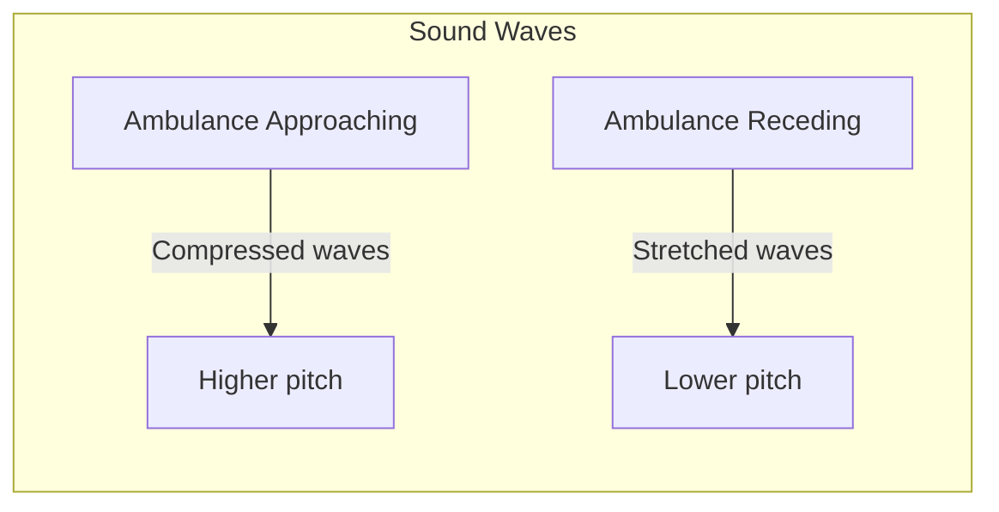

The same principle works with radio waves, except instead of changing pitch, radar guns measure **frequency shifts**.

### Wave Compression: The Core Principle

When your car moves toward a radar gun:

1. **The radar transmits** radio waves at a known frequency (let's say 24.150 GHz for K-band)
2. **Your car reflects** these waves back, but since it's moving, it adds a little extra "push" to each wave
3. **The reflected waves** return with a slightly higher frequency - they've been compressed
4. **The radar gun measures** this frequency difference and calculates your speed

**Wave compression happens because:**
- Each reflected wave gets a "boost" from your car's forward motion
- The faster you're going, the bigger the frequency shift
- This shift is directly proportional to your speed

### The Mathematics That Makes It Work

The Doppler frequency shift for radar systems follows this equation:

$$\Delta f = \frac{2v \cos(\theta)}{\lambda}$$

Where:
- $\Delta f$ = Frequency shift (Hz)
- $v$ = Target velocity (m/s) 
- $\theta$ = Angle between radar beam and target motion
- $\lambda$ = Radar wavelength (m)

**The factor of 2 is crucial** - the wave makes a round trip (to the car AND back), so the Doppler effect happens twice.

**Real example:**
- Radar frequency: 24.150 GHz (K-band)
- Wavelength: 0.0124 meters
- Your speed: 50 mph (22.35 m/s)
- Directly approaching ($\theta = 0°$, so $\cos(\theta) = 1$)

$$\Delta f = \frac{2 \times 22.35 \times 1}{0.0124} = 3,603 \text{ Hz}$$

The radar gun detects this 3.6 kHz shift and instantly converts it to 50 mph.

### Why Wave Compression is Perfect for Speed Detection

Wave compression gives radar guns their incredible advantages:

**Instantaneous measurement:** No physical contact needed
**Weather resistant:** Radio waves penetrate rain, fog, and dust  
**Long range:** Effective up to 2 miles for large vehicles
**High accuracy:** ±1-2 mph under proper conditions
**Simple physics:** Direct, measurable relationship between frequency shift and speed

## Inside the Radar Gun: How It Actually Works

### The Three-Component System

A police radar gun is essentially a miniaturized radio station with three key parts working together:

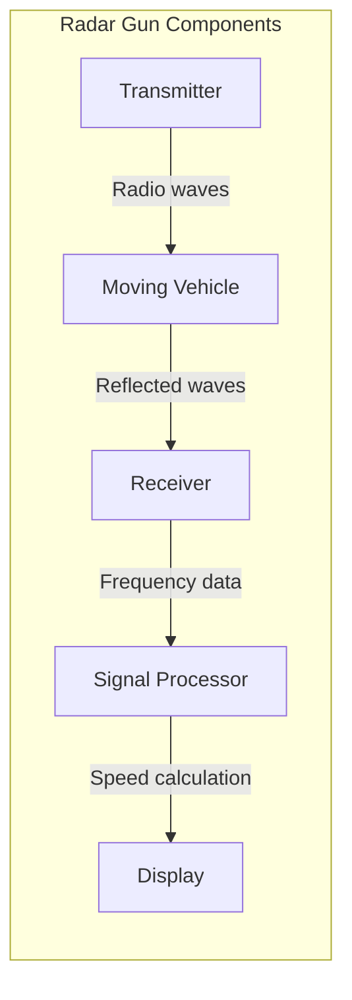

**1. Transmitter:** Generates radio waves at specific frequencies, typically X-band (10.525 GHz), K-band (24.150 GHz), or Ka-band (33.4-36.0 GHz).

**2. Receiver:** Listens for reflected signals and is highly sensitive to tiny frequency changes.

**3. Signal Processor:** The "brain" that calculates frequency shift in real-time and converts it to speed readings.

### Step-by-Step Speed Measurement

Here's what happens in the fraction of a second between trigger pull and speed reading:

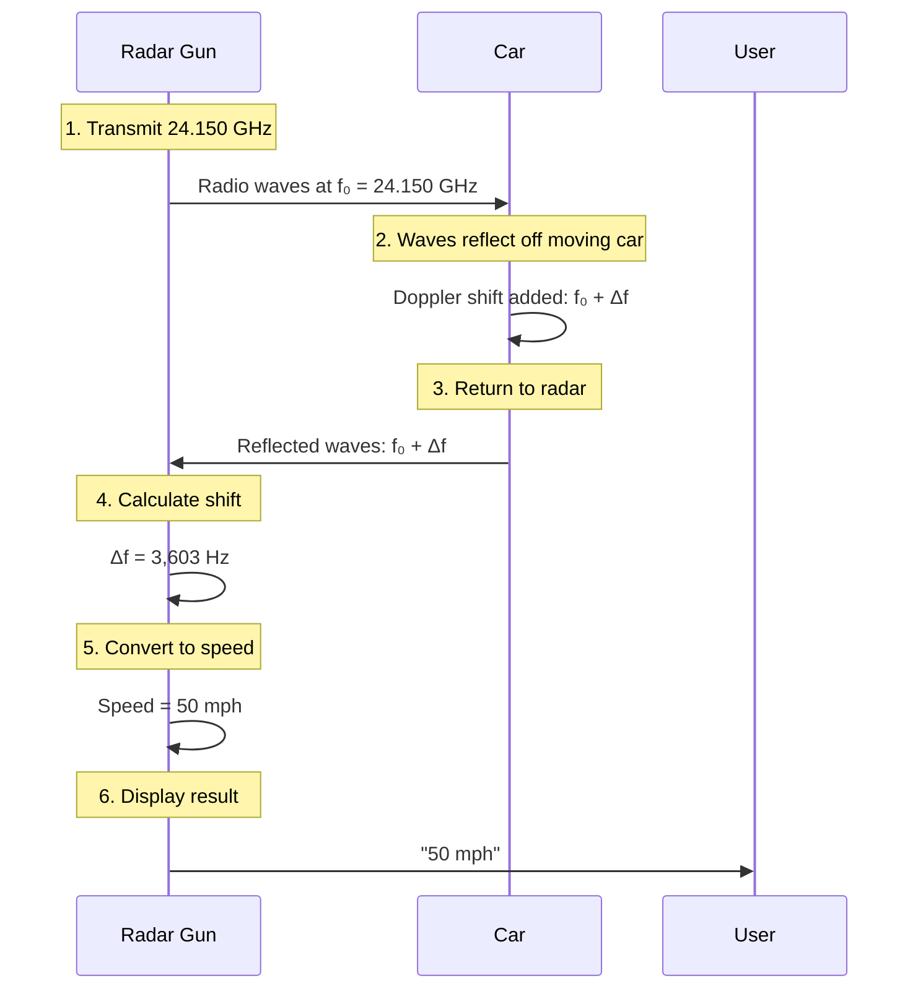

### Why These Specific Frequencies?

Police radar uses specific frequency bands for strategic reasons:

| Frequency Band | Frequency | Wavelength | Trade-offs |
|----------------|-----------|-------------|-----------|
| **X-band** | 10.525 GHz | 2.85 cm | Long range but easily detected |
| **K-band** | 24.150 GHz | 1.24 cm | Good balance of range and accuracy |
| **Ka-band** | 33.4-36.0 GHz | 0.83 cm | Best accuracy but shorter range |

### The Signal Processing Magic

Modern radar guns don't just measure one frequency shift - they use sophisticated processing:

**Signal Processing:**
- **MTI (Moving Target Indication):** Filters out stationary objects
- **FFT (Fast Fourier Transform):** Converts signals to frequency domain for analysis
- **Digital Filtering:** Removes interference and noise
- **Target Selection:** Chooses strongest consistent signal

All this processing happens in milliseconds, giving you that instant speed reading you see on the display.

## Types of Police Radar Systems

### Continuous Wave (CW) Radar: The Workhorse

**Most common in traffic enforcement**, CW radar is the simplest and most reliable system:

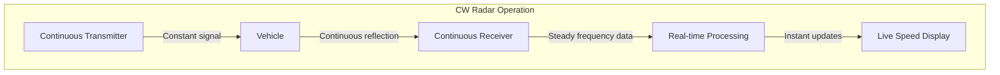

**How it works:**
- Transmits radio waves continuously
- Receives reflections continuously
- Compares transmitted vs. received frequencies in real-time
- Provides instant speed updates

**Advantages:**
- Immediate speed readings
- Simple, reliable technology
- Low power consumption
- Cost-effective for departments

**Limitations:**
- Cannot measure distance (only speed)
- Multiple targets can confuse system
- Stationary operation only (no moving mode)

### Pulse-Doppler Radar: The Advanced System

**More sophisticated and accurate**, pulse-doppler radar is used in high-end systems:

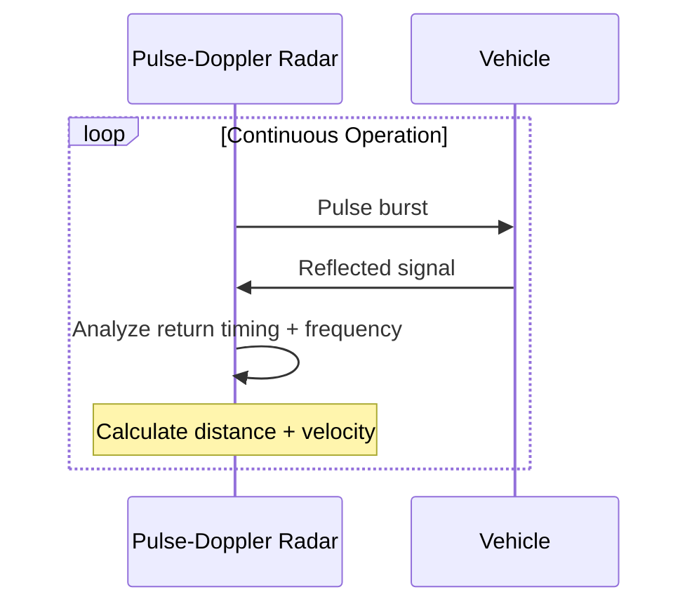

**Key innovations:**
- **Pulse transmission:** Sends short bursts instead of continuous waves
- **Distance measurement:** Time-of-flight calculation gives range
- **Moving capability:** Can be used from moving patrol cars
- **Better target discrimination:** Can separate multiple vehicles

**Advanced features:**
- Target tracking over time
- Speed AND distance measurement
- Moving mode capability (patrol car can measure while driving)
- Multiple target handling

### Photo Radar: The Evidence Collector

**Combines radar measurement with photography** for automatic ticketing systems:

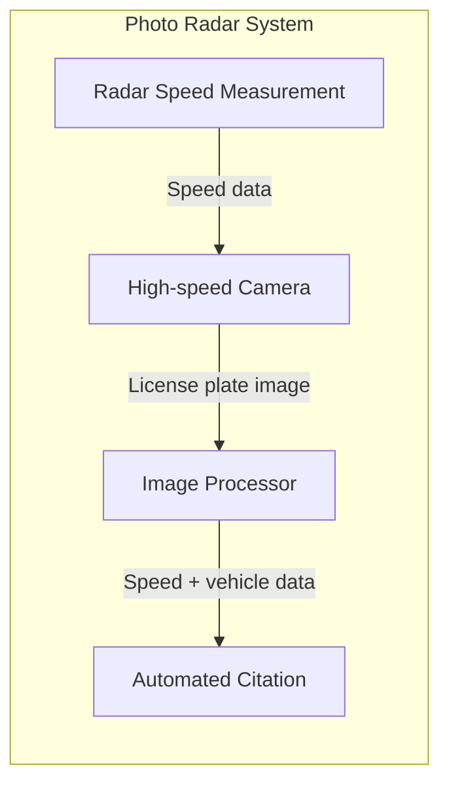

**Components:** Radar sensor, high-resolution camera, flash system, image processing software, and automatic ticket generation.

**Benefits:** Reduced workload, photographic evidence, 24/7 operation, and consistent enforcement.

### Laser (Lidar): The Precision Alternative

**While not technically radar**, laser speed detection is worth mentioning:

| Technology | Radar | Laser (Lidar) |
|------------|-------|---------------|
| **Wave type** | Radio waves | Infrared laser |
| **Beam width** | Wide (15-30°) | Narrow (0.25°) |
| **Range** | Up to 2 miles | Up to 4,000 feet |
| **Multi-target** | Problematic | Excellent |
| **Weather resistance** | Good | Fair |
| **Detection** | Easy (radar detectors) | Hard (laser detectors) |

**Why laser is gaining popularity:**
- Pinpoint accuracy (can target specific vehicle)
- No cosine angle errors
- Very difficult to detect
- Excellent at picking out individual vehicles in traffic

**But radar remains dominant because:**
- Works better in bad weather
- Less operator training required
- Better for sweeping traffic
- Lower maintenance costs

Each system has its place, and most modern police departments maintain multiple types for different enforcement scenarios.

## Real-World Factors: Why Radar Isn't Perfect

### The Cosine Effect: Geometry Matters

**The biggest source of error in radar measurements** comes from simple geometry:

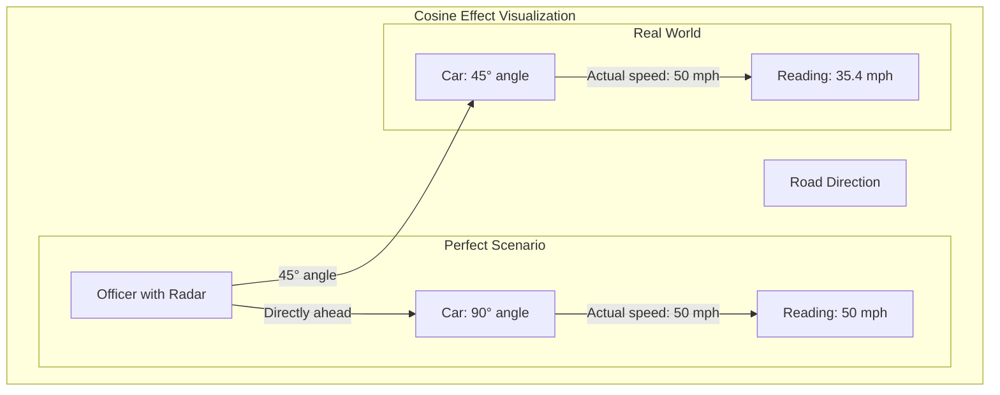

**The mathematics:**
The measured speed = actual speed × cos(angle)

- **0° angle (directly ahead):** cos(0°) = 1.0 → 100% accurate
- **45° angle:** cos(45°) = 0.707 → 70.7% of actual speed
- **60° angle:** cos(60°) = 0.5 → 50% of actual speed

**Why this matters:**
- Radar always **underestimates** speed (never overestimates)
- This error actually favors drivers
- Officers are trained to minimize angles
- Angles over 30° significantly reduce accuracy

### Multi-Target Confusion

**Radar guns struggle with multiple vehicles** because they typically measure the strongest return signal:

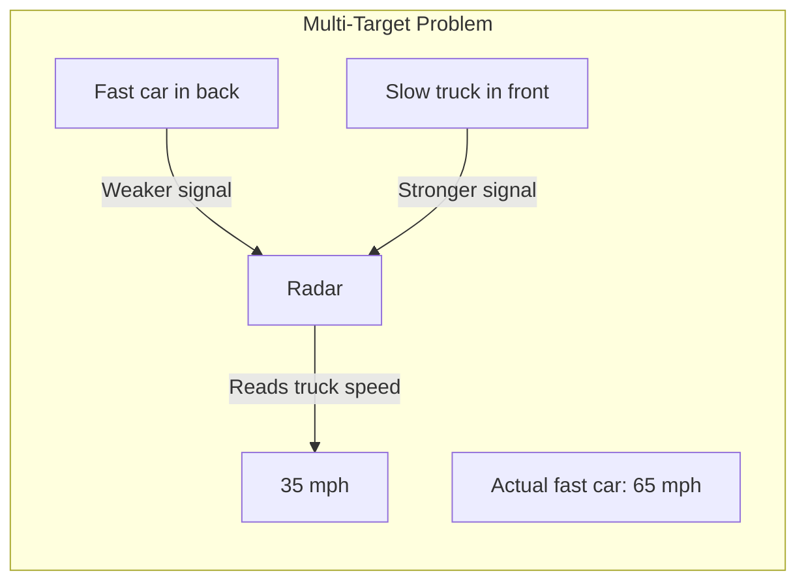

**What causes confusion:**
- Larger vehicles reflect more signal
- Closer vehicles return stronger signals
- Radar can't always "see" behind larger vehicles
- Multiple reflections create ghost readings

**Modern solutions:**
- Digital signal processing to distinguish targets
- Multiple antenna systems
- Operator training for target identification
- Laser systems for precise targeting

### Weather and Environmental Factors

**Weather affects radar performance** in surprising ways:

| Condition | Effect on Accuracy |
|-----------|-------------------|
| **Heavy Rain** | Minimal interference |
| **Fog** | No significant effect |
| **Snow** | Minimal effect |
| **Extreme Heat** | Atmospheric refraction |
| **Electrical Interference** | Major problems |

**Environmental challenges** include multipath reflections, electromagnetic interference, and terrain features affecting line-of-sight.

### Range and Detection Limitations

**Radar range varies dramatically** by target size and type:

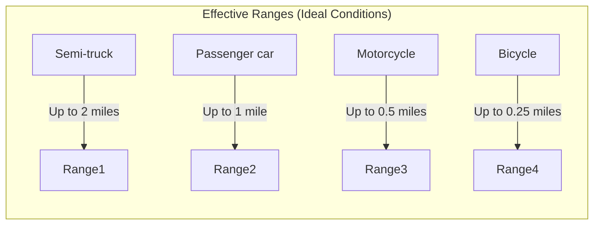

**Factors affecting range:**
- **Target size:** Larger vehicles reflect more energy
- **Reflectivity:** Metal bumpers, grilles enhance detection
- **Speed:** Faster targets create stronger Doppler shift
- **Antenna gain:** More powerful transmitters increase range
- **Weather:** Extreme conditions reduce effective range

**Practical limitations:**
- Most police work under 0.5 miles for safety
- Moving mode radar has shorter range than stationary
- Urban environments reduce effective range due to interference

### Countermeasures: Radar Detectors

**Radar detectors work** by listening for police radar frequencies:

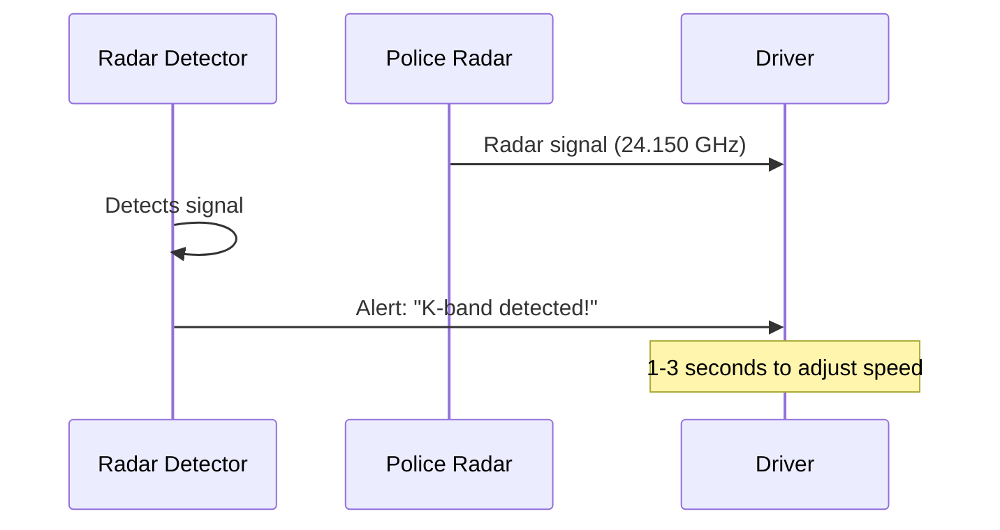

**Effectiveness by frequency band:**
- **X-band:** Very easy to detect (longest warning time)
- **K-band:** Moderate detection range (most common)
- **Ka-band:** Hardest to detect (shortest warning time)
- **Instant-on radar:** Minimal warning time (tactical advantage)

**Modern countermeasures:**
- GPS database of known speed trap locations
- Laser detectors (for LiDAR systems)
- Radar jammers (illegal in most jurisdictions)
- Stealth vehicle modifications (limited effectiveness)

**The arms race continues:**
- Police use instant-on radar to minimize detector warnings
- Some departments use frequency hopping
- Operators learn to minimize radar use until target identified

Despite these limitations, properly used radar systems remain highly reliable speed measurement tools with well-understood accuracy margins.

## Legal Standards and Calibration: Evidence in Court

### Why Courts Accept Radar Evidence

**Radar gun evidence is admissible in virtually every jurisdiction** because it meets scientific reliability standards:

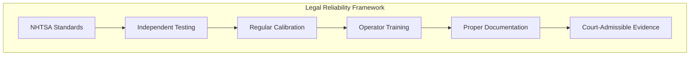

**Key legal requirements:**
- **Scientific validity:** Doppler effect is well-established physics
- **Reliability:** Consistent results under controlled conditions
- **Standards compliance:** NHTSA-mandated testing and specifications
- **Proper operation:** Trained officers following established procedures

### NHTSA Performance Standards

**The National Highway Traffic Safety Administration (NHTSA)** sets mandatory standards for police radar:

| Requirement | Standard | Testing Method |
|-------------|----------|----------------|
| **Accuracy** | ±1 mph (under 55 mph) | Tuning fork tests |
| **Accuracy** | ±2 mph (over 55 mph) | Tuning fork tests |
| **Frequency stability** | ±0.001% | Oscillator testing |
| **Temperature range** | -30°F to 120°F | Environmental chamber |
| **Battery life** | Minimum 8 hours | Operational testing |
| **Display readability** | Day/night visible | Visual inspection |

**Regular testing:** Daily tuning fork verification, weekly calibration, monthly maintenance, annual certification.

### Calibration Procedures: The Tuning Fork Test

**Every officer performs tuning fork tests** before using radar equipment:

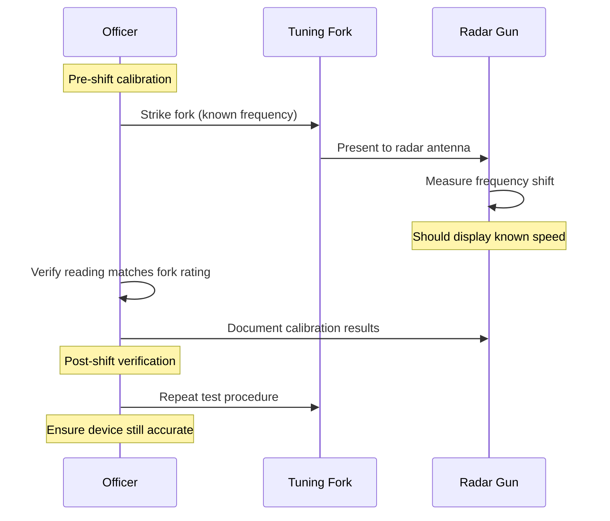

**Why tuning forks work:** Each fork vibrates at a precise frequency that mimics a specific speed when held near radar, providing immediate accuracy verification.

**Documentation requirements:** Calibration dates/times, tuning fork serial numbers, test results, operator details, and any deviations.

### Operator Training Standards

**Proper training is crucial** for reliable radar operation:

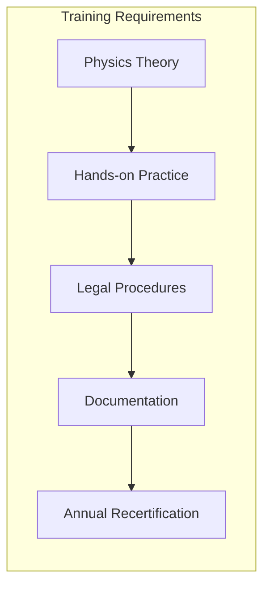

**Training:** Physics, equipment operation, target identification, angle awareness, environmental factors, legal requirements, and calibration procedures.

**Certification:** 16 hours classroom, 8 hours practical, written exam, practical demonstration, and annual refresher training.

### Court Challenges and Defense Strategies

**Defense attorneys commonly challenge radar evidence** using specific strategies:

| Challenge Type | Common Arguments | Success Rate |
|----------------|------------------|--------------|
| **Calibration** | "Device not calibrated" | Low (officers document calibration) |
| **Operator error** | "Improper angle" | Moderate (requires expertise) |
| **Multi-target** | "Wrong vehicle measured" | Moderate (requires specific facts) |
| **Interference** | "External interference" | Low (requires expert testimony) |
| **Equipment fault** | "Radar malfunction" | Low (NHTSA standards help) |

**Successful defense strategies:** Proving procedural violations, excessive angles, multi-target confusion, environmental interference, or maintenance issues.

**Why most challenges fail:**
- Standardized procedures are well-documented
- Courts recognize radar reliability when properly used
- Officers are trained to document everything
- NHTSA standards provide scientific backing

### Chain of Custody for Evidence

**Evidence integrity:** Requires acquisition documentation, calibration verification, maintenance records, training certification, and expert testimony when needed.

**Quality control:** Serial number tracking, maintenance logs, calibration certification, and training records.

This rigorous approach ensures radar evidence withstands legal scrutiny while maintaining public confidence in speed enforcement technology.

## The Future of Speed Detection Technology

### Digital Signal Processing Revolution

**Modern radar guns are essentially specialized computers** with incredible processing power:

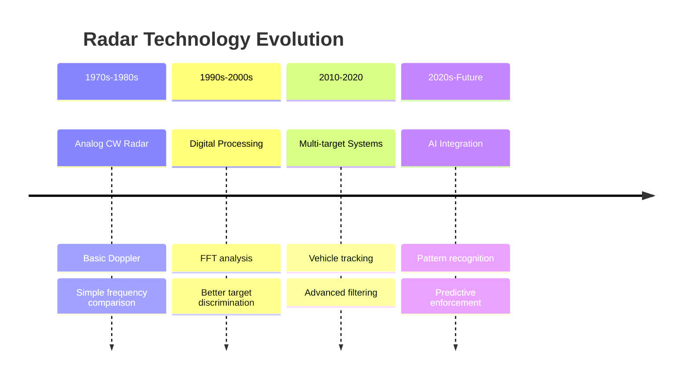

**Current innovations:** Machine learning for traffic patterns, adaptive filtering, multi-beam systems for multiple lanes, and predictive analytics.

**What this means:** More accurate readings, better performance in adverse weather, reduced false positives, and integration with automated traffic management.

### Connected Vehicle Integration

**The future includes vehicle-to-infrastructure communication** that could revolutionize speed enforcement:

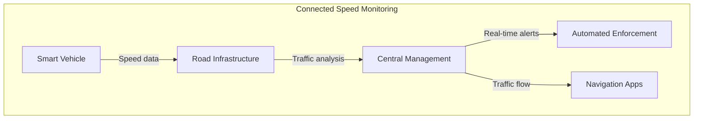

**Potential systems:** Automatic speed reporting, adaptive speed limits, predictive enforcement, and integrated traffic management.

**Privacy and legal challenges:** Data collection regulations, privacy concerns, legal framework for automated citations, and public acceptance.

### Beyond Radar: Emerging Technologies

**While radar remains dominant, new technologies are emerging:**

| Technology | Advantages | Limitations | Timeline |
|------------|------------|-------------|----------|
| **Lidar/Laser** | Extreme accuracy, narrow beam | Weather sensitivity, cost | Current |
| **Video Analytics** | Multi-lane monitoring, evidence collection | Processing intensive, privacy concerns | Near-term |
| **AI Vision Systems** | Pattern recognition, predictive capabilities | Training data requirements, bias concerns | Mid-term |
| **Quantum Sensors** | Ultimate precision, interference immunity | Experimental, expensive | Long-term |

**The hybrid approach:**
- Combining radar with other sensors for redundancy
- Multi-sensor fusion for better accuracy
- Redundant systems for legal defensibility
- Adaptability to different enforcement scenarios

### Regulatory and Policy Evolution

**Speed detection technology must evolve with changing transportation:**

**Future considerations:** Autonomous vehicle responsibility, electric vehicle profiles, and smart city traffic integration.

### The Physics Remains the Same

**Despite all the technological advances, the fundamental physics doesn't change:**

- **Doppler effect** remains the core principle
- **Wave compression** still provides the measurement mechanism
- **Frequency shift** still translates to speed
- **Cosine effect** still requires proper positioning

**What changes:** Smarter signal processing, sophisticated data analysis, better system integration, tighter accuracy, and reduced human error.

**The human element:** Officers still make final decisions, legal oversight remains, training and judgment stay essential.

---

## The Bottom Line

**Radar guns work because of elegant physics applied to practical problems.** By turning the invisible compression of radio waves into measurable frequency shifts, these devices transform fundamental wave physics into reliable speed measurements.

**The technology's success comes from:**
- Solid scientific foundation (Doppler effect proven in 1842)
- Consistent mathematical relationships between frequency and speed
- Rigorous standards and calibration procedures
- Proper operator training and legal frameworks

**What this means for you:**
- When properly used, radar guns are remarkably accurate
- The physics favors drivers (cosine effect underestimates speed)
- Legal challenges rarely succeed against properly calibrated equipment
- The technology continues to evolve but stays grounded in the same physics

**Next time you see a radar gun pointed your way, remember:** You're witnessing centuries of physics knowledge, decades of engineering refinement, and years of legal precedent all working together to measure how fast you're compressing the fabric of space-time itself (well, at least the radio waves traveling through it).

And that's pretty fascinating when you think about it.

---

## Learn More

**Technical Resources:**
- [NHTSA Speed Measurement Device Standards](https://www.nhtsa.gov/equipment/ speed-measuring-devices)
- [Doppler Effect Physics - Physics LibreTexts](https://phys.libretexts.org/Bookshelves/University_Physics/University_Physics_(OpenStax)/Book%3A_University_Physics_I_-_Mechanics_Sound_Oscillations_and_Waves_(OpenStax)/17%3A_Sound/17.08%3A_The_Doppler_Effect)
- [RF Cafe Doppler Frequency Shift Equations](https://www.rfcafe.com/references/electrical/doppler.htm)
- [Introduction to Radar Systems - Merrill Skolnik (Textbook)](https://www.pearson.com/en-us/subject-catalog/p/introduction-to-radar-systems/P200000003608/9780133113953)

**Practical Applications:**
- [Police Radar Training Manual - International Association of Chiefs of Police](https://www.theiacp.org/resources/traffic-safety)
- [Calibration Procedures for Speed Measurement Equipment](https://www.nist.gov/si-research/calibrations)
- [Court Cases on Radar Evidence Admissibility](https://law.justia.com/cases/state/)
- [Weather Effects on Radar Propagation](https://www.weather.gov/)

**Advanced Topics:**
- [Pulse Compression Radar Techniques](https://ieeexplore.ieee.org/document/4646567/)
- [Digital Signal Processing for Radar Systems](https://dsp-book.narod.ru/RSAD/C1828_PDF_C07.pdf)
- [Machine Learning in Radar Target Recognition](https://arxiv.org/abs/2003.05872)
- [Connected Vehicle Standards for Speed Monitoring](https://www.sae.org/standards/content/j3061_1_202109/)

**Hands-on Learning:**
- [Homemade 6 GHz Pulse Compression Radar Project](https://hforsten.com/homemade-6-ghz-pulse-compression-radar.html)
- [Radar Speed Gun Calibration Tools and Procedures](https://www.nist.gov/si-research/calibrations/time-frequency)
- [How Police Radar Works - Vortex Radar (YouTube)](https://www.youtube.com/watch?v=DAwW7_nYG0c)

**Historical Context:**
- [Christian Doppler and the Doppler Effect (1842)](https://www.britannica.com/biography/Christian-Doppler)
- [History of Radar Technology](https://www.ieeeghn.org/wiki/index.php/History_of_Radar)
- [Evolution of Traffic Enforcement Technology](https://www.nhtsa.gov/equipment/traffic-enforcement)

**Research and Development:**
- [University Radar Laboratories](https://www.mitre.org/centers/intelligence-technology)
- [IEEE Aerospace and Electronic Systems Society](https://www.aess.org/)
- [International Radar Symposium Proceedings](https://www.irs-conferences.org/)

---

**Want to dive deeper into the physics?** Check out the resources above for everything from basic wave mechanics to advanced signal processing algorithms. The world of radar technology combines elegant physics with practical engineering in ways that continue to evolve and improve our ability to measure and understand motion.
