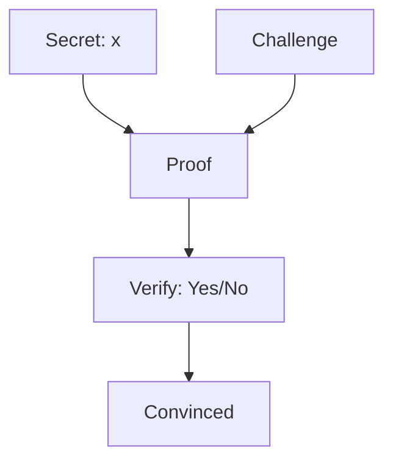
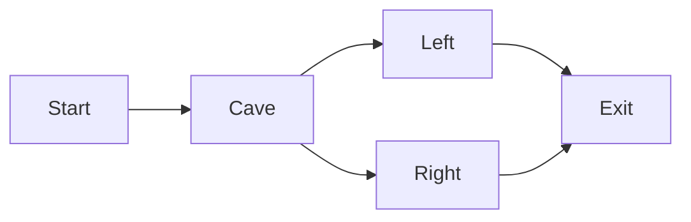
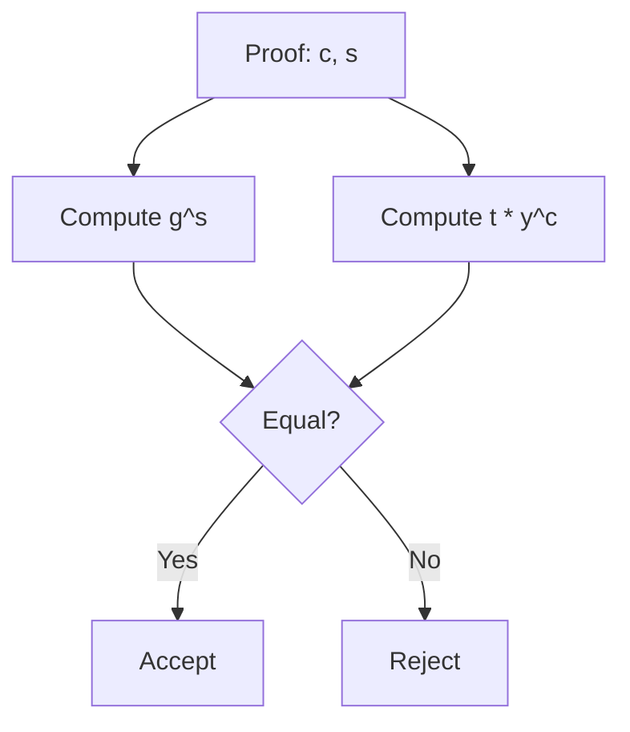

## What is a Zero Knowledge Proof?

Imagine you have a secret password, and you want to prove to someone that you know the password without actually telling them what it is. This sounds impossible - but it's exactly what Zero Knowledge Proofs (ZKPs) achieve.

A Zero Knowledge Proof is a cryptographic method where one party (the **prover**) can prove to another party (the **verifier**) that they know a secret, without revealing any information about the secret itself.

### The Three Properties

For a proof to be "zero knowledge," it must satisfy three properties:

1. **Completeness**: If the prover is telling the truth, the verifier will be convinced
2. **Soundness**: If the prover is lying, the verifier will reject the proof (with high probability)
3. **Zero Knowledge**: The verifier learns nothing about the secret, only that the prover knows it

## A Simple Example: The Cave

The classic example is Ali Baba's cave:

Here's how it works: There's a cave with a magic door connecting left and right paths. Alice knows the magic word to open the door. She wants to prove to Bob she knows it without telling him the word.

1. Alice enters the cave alone through one path
2. Bob waits outside and shouts which path he wants her to exit from
3. If Alice knows the magic word, she can always come out the requested path (even if she entered the opposite side)
4. If she doesn't know it, she can only exit the path she entered (50% chance of being caught)

After many rounds, Bob becomes convinced Alice knows the secret - without ever learning the magic word.

## Interactive vs Non-Interactive Proofs

### Interactive Proofs

In the cave example, Alice and Bob communicate back and forth - this is an **Interactive Zero Knowledge Proof**. Each round involves a challenge from the verifier and a response from the prover.

### Non-Interactive Proofs (NIZK)

The problem with interactive proofs is they require both parties to be online and communicate. **Non-Interactive Zero Knowledge Proofs (NIZKs)** solve this by using a shared reference string that allows the prover to create a single proof that anyone can verify.

This is incredibly useful in blockchain and privacy-preserving systems.

## Schnorr's Protocol: The Building Block

Schnorr's protocol is one of the most elegant and widely-used NIZK proofs. It's based on the **discrete logarithm problem** - the assumption that it's computationally hard to find $x$ given $g^x$ (where $g$ is a generator of a cyclic group).

### The Setup

Let's work with real numbers to understand the intuition (in practice, we use modular arithmetic):

- Let $p$ be a large prime
- Let $g$ be a generator of the group (think of it as a "base point")
- Let $x$ be the **secret** (the private key)
- Let $y = g^x$ be the **public key**

The prover wants to prove they know $x$ without revealing $x$.

### Schnorr's Protocol Step by Step

**The Problem**: Prove knowledge of $x$ such that $y = g^x$ without revealing $x$.

**Step 1: Commitment**

The prover picks a random value $k$ (called the nonce or commitment) and computes:
$$t = g^k$$

The prover sends $t$ to the verifier. This is a "blinding factor" - it hides what comes next.

**Step 2: Challenge**

The verifier responds with a random challenge $c$. In the non-interactive version, $c$ is computed using a hash function:
$$c = H(t || y)$$

where $H$ is a cryptographic hash function and $\parallel$ means concatenation.

**Step 3: Response**

The prover computes:
$$s = k + c \cdot x$$

The key insight is that the prover can compute $s$ because they know both $k$ and the secret $x$.

**The Proof**: The prover sends $(c, s)$ to the verifier.

**Step 4: Verification**

The verifier checks:
$$g^s \stackrel{?}{=} t \cdot y^c$$

Let's verify this mathematically:
$$g^s = g^{k + c \cdot x} = g^k \cdot g^{c \cdot x} = t \cdot (g^x)^c = t \cdot y^c$$

If the equality holds, the verifier is convinced!

### Real Number Example

Let's use actual numbers to see how this works:

**Setup**:
- Let $g = 2$ (simplified generator)
- Let secret $x = 5$
- Public key: $y = 2^5 = 32$

**Prover's Steps**:

1. Pick random $k = 3$
2. Compute commitment: $t = 2^3 = 8$
3. Compute challenge: Let's say hash gives us $c = 7$ (in practice this comes from a hash function)
4. Compute response: $s = k + c \cdot x = 3 + 7 \cdot 5 = 3 + 35 = 38$

**The Proof**: Send $(c=7, s=38)$ to verifier

**Verifier's Steps**:

1. Receive $(c=7, s=38)$
2. Check: $g^s = 2^{38} = 274,877,906,944$
3. Check: $t \cdot y^c = 8 \cdot 32^7 = 8 \cdot 34,359,738,368 = 274,877,906,944$

They match! The verifier is convinced.

**What did the verifier learn?**

- $c = 7$ (random challenge)
- $s = 38$ (response)

But $s = k + cx$ means $38 = 3 + 7x$, so $x = 5$! Wait... in this real-number example, the verifier *can* solve for x. This is why we use modular arithmetic in practice.

In modular arithmetic with large primes, the verifier **cannot** recover $x$ from $s$ and $c$ because they can't "undo" the modular exponentiation.

The verification check:

This equation holds for the prover (who knows x) but the verifier can only check the equality - they can't solve for x.

## Why Schnorr's Protocol Matters

### 1. Non-Interactive

Unlike earlier ZKPs, Schnorr doesn't require back-and-forth communication. One message proves everything.

### 2. Aggregateable

Multiple Schnorr signatures can be combined into a single signature. This is incredibly powerful for blockchain scaling.

### 3. Foundations for Modern ZK

Schnorr is the foundation for many modern ZK systems:
- **Schnorr Signatures** (used in Bitcoin)
- **Bulletproofs** (confidential transactions)
- **ZK-SNARKs** (used in Zcash)
- **ZK-STARKs** (transparent ZK proofs)

## The Security Assumption

Schnorr's security rests on the **Discrete Logarithm Assumption**: given $g$ and $g^x$, it's computationally infeasible to find $x$ when the group is large enough.

This is the same assumption that underlies:
- Diffie-Hellman key exchange
- RSA (with some differences)
- Most modern public-key cryptography

## Limitations and Considerations

### The Random Oracle Model

Schnorr's NIZK version uses the **random oracle model** - assuming we have a perfect hash function. In practice, we use concrete hash functions like SHA-256.

---

## The Bottom Line

Zero Knowledge Proofs let you prove you know something without revealing it. Schnorr's protocol is a beautiful example that:

- Is simple to understand ( witheven real numbers)
- Is efficient (one message)
- Is widely used (blockchains, authentication)
- Is the foundation for modern ZK systems

The intuition is powerful: by adding a random "blinding" factor and responding to a challenge, we create a proof that only someone with the secret could generate - yet the verifier never sees the secret.

---

## Learn More

**Foundational Papers:**
- [Schnorr's Original Paper](https://link.springer.com/article/10.1007/BF00196725)
- [Zero Knowledge Definitions](https://en.wikipedia.org/wiki/Zero-knowledge_proof)

**Interactive Demos:**
- [ZKPDL: A Language for Programming Zero-Knowledge Proofs](https://zKDLP.github.io/)
- [Cryptography Playground](https://cryptography.io/)

**Modern ZK Systems:**
- [ZK-SNARKs: From Zero to Hero](https://arxiv.org/abs/1906.07221)
- [ZK-STARKs: Scalable Transparent ZKPs](https://eprint.iacr.org/2018/046)

**Applications:**
- [Zcash: Privacy-Preserving Cryptocurrencies](https://z.cash/)
- [Ethereum ZK Rollups](https://ethereum.org/en/developers/docs/scaling/zk-rollups/)
